# IndexVault

**A fast, local research app for Indian market indices.** Download NIFTY, SENSEX,
sectoral indices and India VIX from free sources, cache them on your computer, and turn
them into research-grade tables, charts and exports. Every default, number and colour
is yours to change.

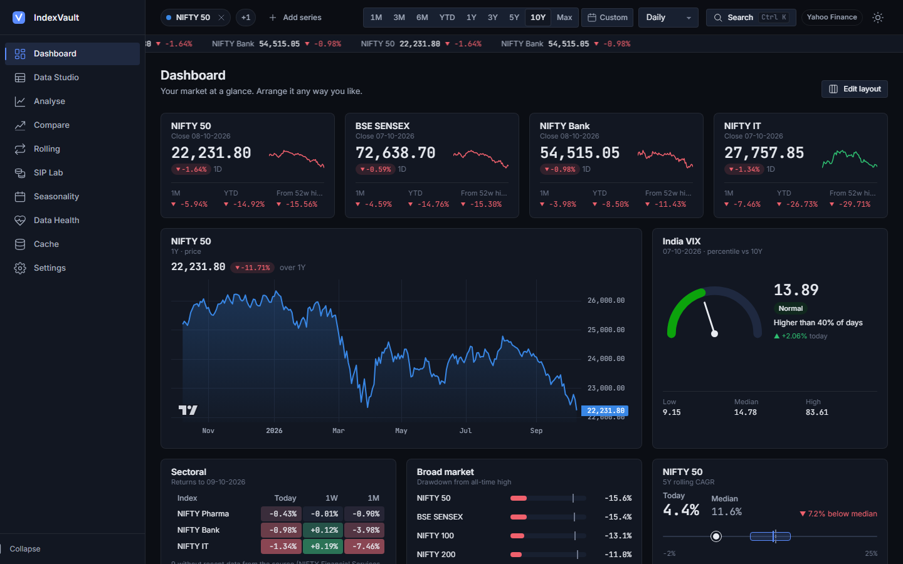

FastAPI + pandas on the back, hand-written HTML/CSS/JS on the front: no framework, no
build step, no npm. Runs on `localhost`; nothing leaves your machine except the data
requests to Yahoo Finance.

---

## Features

| Page | What it does |
|---|---|
| **Dashboard** | 12-column widget grid you arrange yourself: drag, resize, keyboard. Snapshot cards, mini charts, sector heatmap, India VIX gauge with percentile, drawdown monitor, rolling-return snapshot, Markdown notes. |
| **Data Studio** | OHLCV tables at any frequency (daily → yearly) with derived columns (returns, SMA/EMA, RSI, volatility, drawdown…). Virtual scrolling, sorting, export to Excel, CSV, CSV-zip or JSON, saved export presets. |
| **Analyse** | One series in depth: KPI cards, trailing returns, price chart with SMAs and big-move markers, drawdowns, monthly-returns heatmap, yearly returns, return distribution, rolling volatility. |
| **Compare** | Growth of 100, side-by-side metrics with beta, correlation matrix, risk-vs-return scatter, relative strength, rolling correlation. |
| **Rolling** | Rolling CAGR for any holding period, distribution, and how often each index beat your target, in plain English. |
| **SIP Lab** | Monthly SIP backtests with step-ups and lump-sum top-ups, XIRR, lump-sum comparison, start-date sensitivity, saved scenarios. |
| **Seasonality** | Month-of-year and weekday patterns, with an honest caution about noise. |
| **Data Health** | Gaps, stale runs, OHLC inconsistencies, duplicates and big moves for each series. |
| **Cache** | What's downloaded and how fresh it is; update, re-download or delete; ticker health check. |
| **Settings** | Every setting editable, rendered from the settings schema: themes, theme editor with a colour-blind palette check, formats, data defaults, analytics parameters, catalogue & watchlists, shortcuts, backup/restore. |

Across the app:
- **Shared selection in the URL.** Pick series, a date range and a frequency once; every page uses them, and any view is a shareable link (`#/analyse?s=^NSEI&p=10Y&f=M`).
- **Command palette** (`Ctrl/⌘ K`) for every page and action, plus rebindable shortcuts.
- **Indian conventions by default:** ₹, lakh/crore grouping, DD-MM-YYYY (all switchable).
- **Four themes** (Midnight, Paper, Terminal, Saffron), light/dark/system mode, and your own themes and chart palettes.
- **Accessible:** keyboard-reachable everywhere, visible focus rings, reduced-motion support, colour never the only signal, "view as table" on every chart.
- **Fast:** long series are downsampled with LTTB for drawing (extremes always kept), heavy analytics are memoised on the server, and chart libraries load only on pages that use them.

## Screenshots

| | |
|---|---|
| 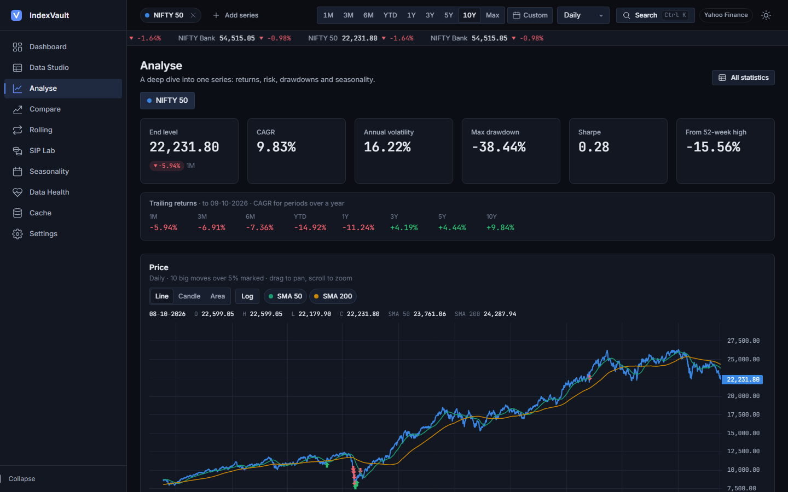 **Analyse** | 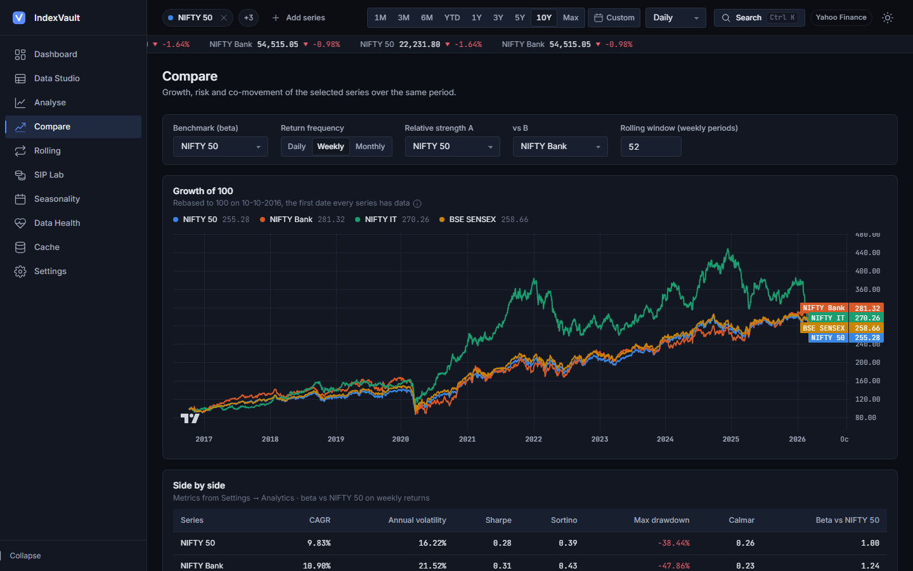 **Compare** |
| 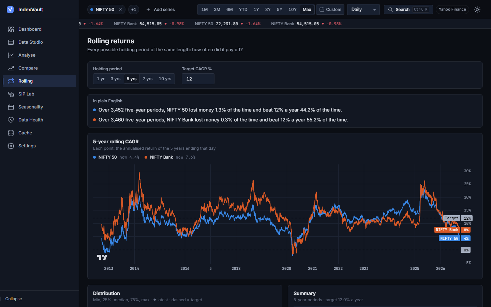 **Rolling returns** | 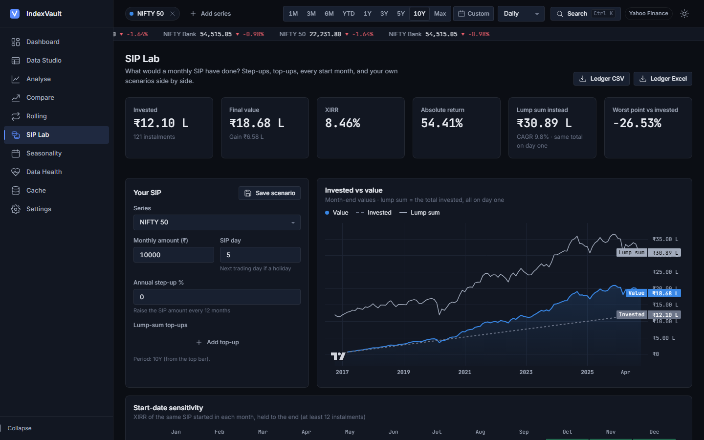 **SIP Lab** |
| 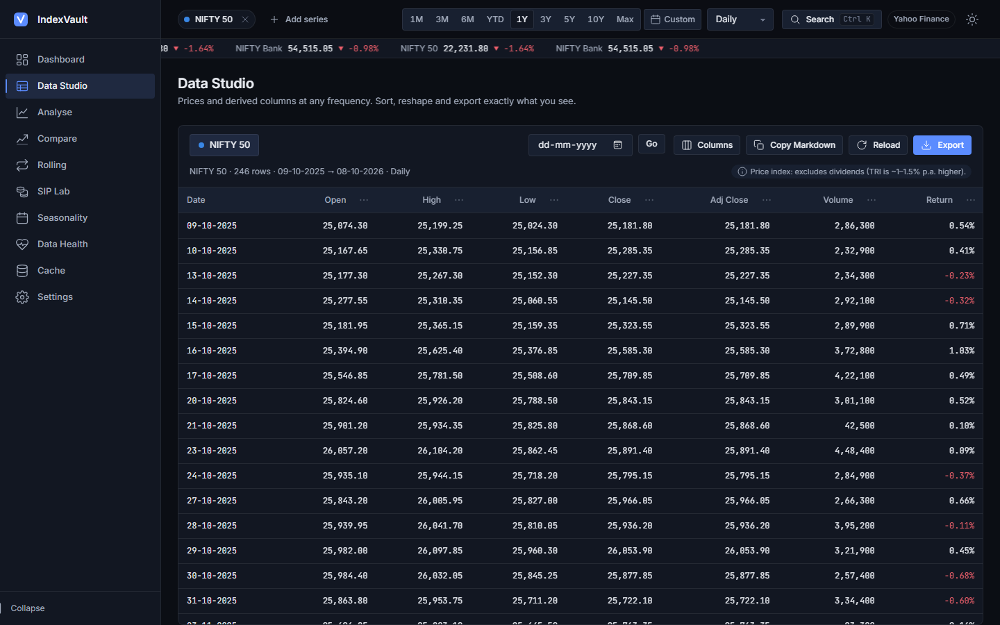 **Data Studio** | 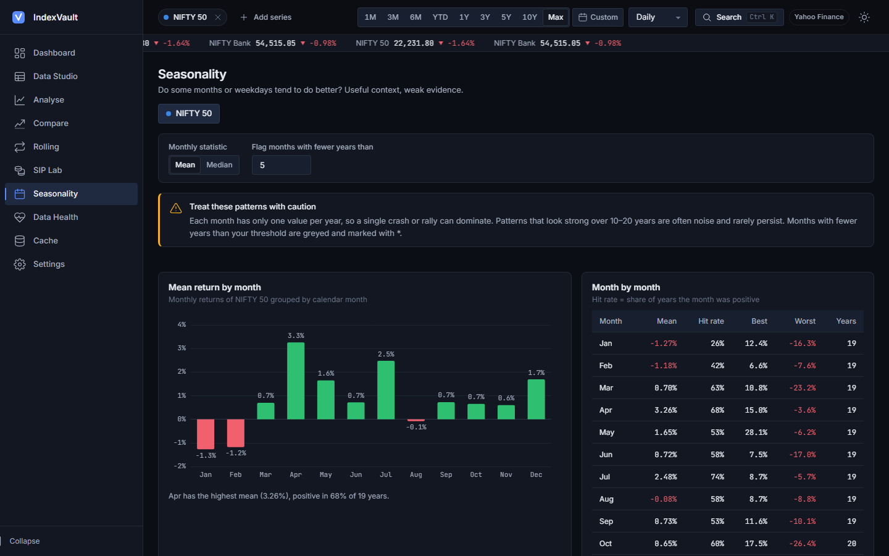 **Seasonality** |
| 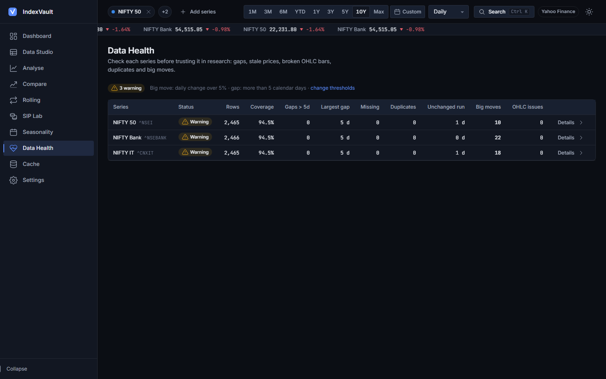 **Data Health** | 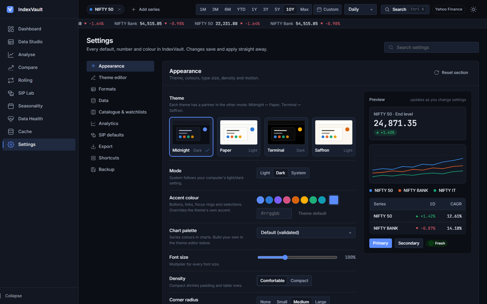 **Settings** |

**Themes:**

| Midnight (dark) | Paper (light) |
|---|---|
|  | 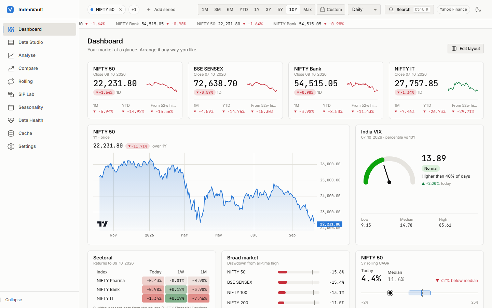 |
| **Terminal (dark)** | **Saffron (light)** |
| 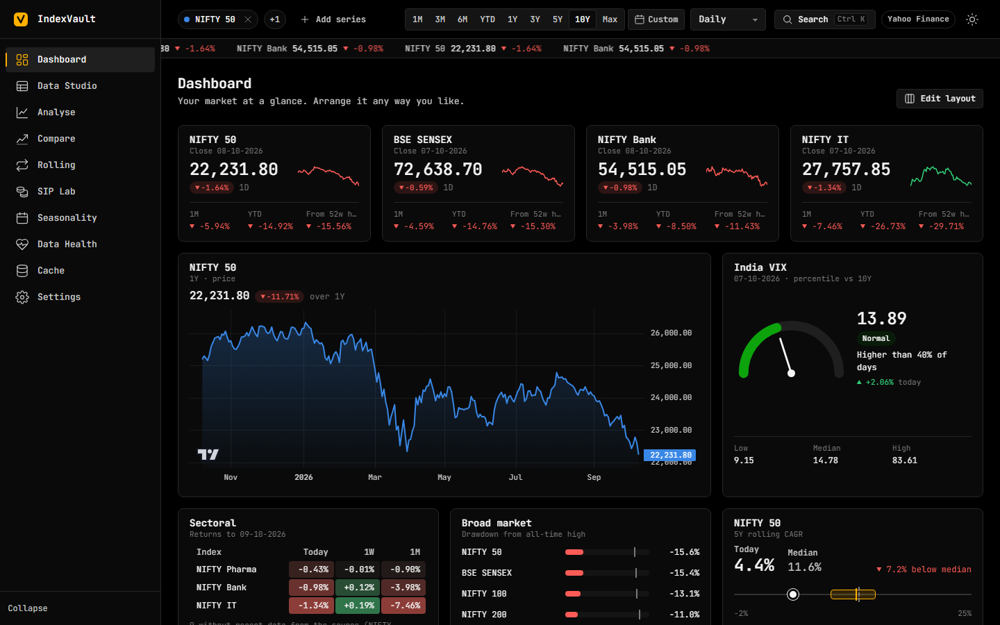 | 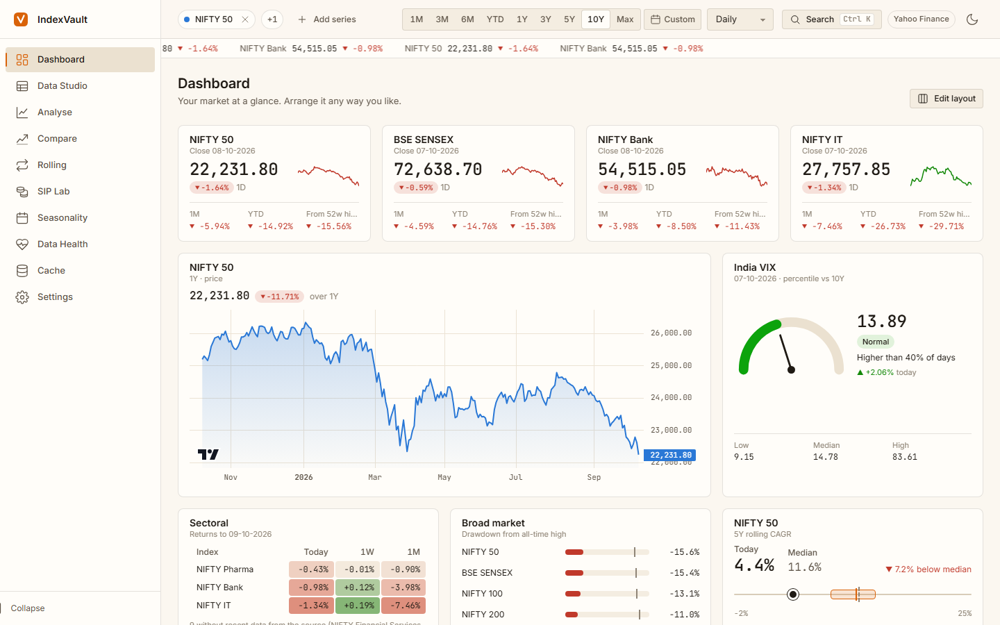 |

**On a phone (390 px):**

<p>
  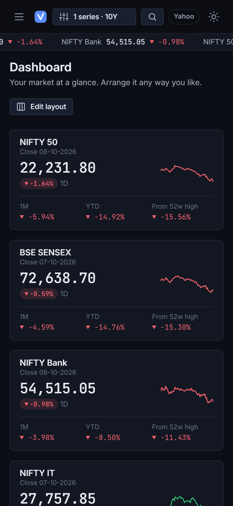
  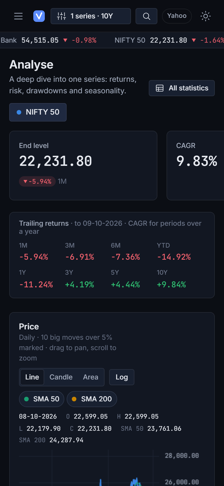
</p>

---

## Setup

You need **Python 3.11 or newer** (developed on 3.14). Nothing else: the chart
libraries and fonts are already in `frontend/vendor/` and `frontend/fonts/`.

**Windows (PowerShell)**
```powershell
git clone <this repo> indexvault
cd indexvault\backend
py -m venv .venv
.venv\Scripts\python -m pip install -r requirements.lock
.venv\Scripts\python -m uvicorn api.main:app --port 8000
```

**macOS / Linux**
```bash
git clone <this repo> indexvault
cd indexvault/backend
python3 -m venv .venv
.venv/bin/python -m pip install -r requirements.lock
.venv/bin/python -m uvicorn api.main:app --port 8000
```

Open **http://localhost:8000**. On first run IndexVault creates `config/settings.json`
from the defaults and downloads data the first time you look at a series. Interactive API
docs are at **http://localhost:8000/api/docs**.

- `requirements.lock` holds the exact versions tested; if one won't install on your
  Python, use `requirements.txt` (version ranges) instead.
- Calling the venv's Python directly avoids PowerShell's script-execution policy, so you
  never need to "activate" the venv.
- No internet? Switch the data source to **Demo** (Settings → Data, or the source badge
  in the top bar) for synthetic data.

**Tests**
```bash
cd backend
.venv/bin/python -m pytest -q        # Windows: .venv\Scripts\python -m pytest -q
```

---

## Command line

The core library ships with a small CLI (run from `backend/`):

```bash
python -m indexvault.cli list                                  # the index catalogue
python -m indexvault.cli fetch "^NSEI" "^NSEBANK" --start 2015-01-01 --freq Monthly --out nifty.xlsx
python -m indexvault.cli update                                # incrementally update every cached ticker
python -m indexvault.cli stats "^NSEI" --start 2010-01-01      # summary statistics
```

Quote tickers that start with `^`. `--source demo` works offline.

## Use it as a library

`backend/indexvault/` is plain Python (pandas, numpy, scipy, yfinance) with no web code,
so notebooks and backtesters can import it directly. It shares the same CSV cache as the
app.

```python
import sys; sys.path.insert(0, "path/to/indexvault/backend")

from indexvault.data import get_data, resample
from indexvault import analytics as an
from indexvault.sip import sip_backtest

df = get_data("^NSEI", start="2015-01-01")          # daily OHLCV, cached and incrementally updated
monthly = resample(df, "Monthly")                    # OHLC-correct, labelled by last trading day
print(an.summary_metrics(df["Close"], rf=0.065))     # CAGR, vol, Sharpe, Sortino, max drawdown, VaR, …
five_year = an.rolling_cagr(df["Close"], 5)          # rolling 5-year CAGR (decimal)
ledger, stats = sip_backtest(df["Close"], amount=10_000, day_of_month=5, step_up_pct=10)
```

Units: the core keeps its original conventions (keys like `"CAGR %"` with values ×100),
so existing scripts don't break. The **HTTP API** returns every percentage as a decimal
(`0.12` = 12%) with plain keys (`cagr`); see [`docs/API.md`](docs/API.md).

The cache folder defaults to `backend/data_cache` and can be changed with the
`INDEXVAULT_CACHE` environment variable or in Settings → Data.

---

## Customisation guide

Everything lives in **Settings**, and changes apply the moment you make them.

- **Look and feel:** theme, light/dark/system mode, accent colour, chart palette, font
  size, density, corner radius, motion (full / reduced / off), market-pulse strip, and
  colour-blind-safe gain/loss colours (blue/red).
- **Your own theme:** Settings → Theme editor. Change any colour token and the whole app
  previews it live; save it as a named theme, export it as JSON to share, import someone
  else's. Text tokens show their contrast ratio as you edit.
- **Chart palettes:** build a series palette and IndexVault checks it the way
  [`docs/DESIGN.md`](docs/DESIGN.md) § 7 describes: neighbouring colours are compared
  under simulated protanopia, deuteranopia and tritanopia (OKLab ΔE ≥ 8), in normal vision
  (ΔE ≥ 15), and for 3:1 contrast on the chart background. Warnings appear inline; saving
  is still allowed.
- **Numbers and dates:** Indian or international grouping, decimals, date format,
  currency symbol.
- **Analytics:** risk-free rate, trading days, SMA/EMA windows, rolling windows,
  thresholds, trailing periods, target CAGR, and which KPI cards and Compare metrics
  appear, in your order.
- **Catalogue & watchlists:** add any Yahoo ticker (stocks, ETFs, global indices) with a
  built-in "Test ticker" check; group series into watchlists (the first one feeds the
  market-pulse strip); import/export as JSON.
- **Dashboard:** press **Edit layout**, then drag, resize, add and configure widgets. With
  the keyboard: Tab to a widget, arrows move it, Shift + arrows resize, Delete removes.
- **Shortcuts:** press Change, then the keys (two-key sequences like `g d` work too).
- **Backup:** one JSON file with settings, themes, palettes, shortcuts, presets, the
  dashboard and your catalogue. Restore it on another computer, or reset everything to
  defaults (your catalogue and cached data are kept).

Settings are stored in `config/settings.json`, and custom indices and watchlists in
`config/catalog.json`. Both are git-ignored. Old or hand-edited files are migrated or set
aside (never deleted) if they don't validate.

**Adding a new setting (developers):** add a field with a default, description and
validation to the Pydantic model in `backend/api/settings.py`. The Settings page renders
it automatically from `GET /api/settings/schema`; add a friendlier label in
`frontend/js/pages/settings/meta.js` if you like.

---

## Data caveats

- **Price indices, not total return.** Yahoo's index levels exclude dividends. Total
  return (TRI) is typically about 1–1.5% a year higher, so CAGRs here understate what an
  index fund earned.
- **Yahoo Finance is unofficial.** Tickers get renamed or retired, and history can go
  missing. At the time of writing several NSE sectoral tickers (Auto, FMCG, Metal, Energy,
  Realty, Media, Infra, PSU Bank, Financial Services) and the Midcap/Smallcap 100 return
  only the latest day. Widgets say so instead of showing empty rows; the **Cache → Ticker
  health check** lists what's broken. Add a working symbol under Settings → Catalogue.
- **Volume.** Index volume used to be zero on Yahoo; some indices (e.g. `^NSEI`) now
  carry it. The app decides per series from the data and labels series without volume.
- **Not investment advice.** IndexVault is a research and learning tool. Past returns,
  rolling statistics and seasonality do not predict future results.

---

## Project layout

```
backend/
  indexvault/   core library: data & cache, sources, analytics, SIP, catalogue, CLI (no web code)
  api/          FastAPI app: routers, settings service & schema, catalogue, jobs, memoisation
  tests/        pytest suite (core + API)
frontend/       index.html, css/, js/ (pages, components, charts), vendor/, fonts/
                see frontend/README.md for a map of every file
config/         your settings.json and catalog.json (created on first run, git-ignored)
docs/           SPEC.md, DESIGN.md, API.md, PROMPTS.md, screenshots/
```

Design system: [`docs/DESIGN.md`](docs/DESIGN.md). Product spec: [`docs/SPEC.md`](docs/SPEC.md).
API response shapes: [`docs/API.md`](docs/API.md).

## Credits and licences

IndexVault is released under the [MIT licence](LICENSE).

Bundled third-party files (see [`frontend/vendor/VERSIONS.md`](frontend/vendor/VERSIONS.md)):
- [TradingView Lightweight Charts™](https://www.tradingview.com/lightweight-charts/), Apache-2.0.
  The TradingView attribution logo on time-series charts is kept as its licence asks.
- [Apache ECharts](https://echarts.apache.org/), Apache-2.0.
- [Inter](https://rsms.me/inter/) and [JetBrains Mono](https://www.jetbrains.com/lp/mono/) fonts, SIL Open Font License 1.1.

Market data comes from Yahoo Finance via [yfinance](https://github.com/ranaroussi/yfinance)
and is subject to Yahoo's terms. It's for personal research only.
